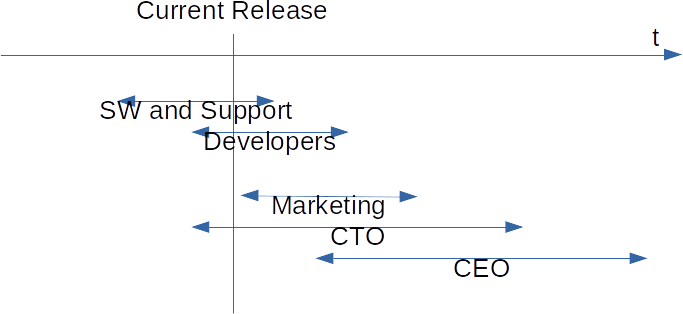

# View horizons

The different roles and positions in an organization have different horizons. So marketing usually things about the next release, while service and support things about the current and previous releases. Here is a quick sketch how I visualize this relation:

