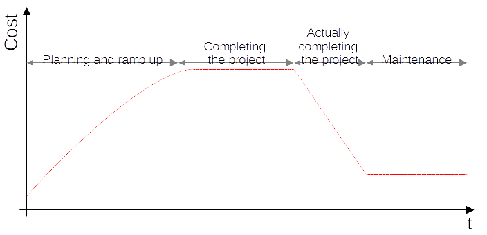

# Cost of IT projects/features over time

Here is a rough sketch on how I perceive the cost of a typical IT project or new feature over time:

1. Planning happens and the more concrete an idea gets, the more people get involved. Perhaps screen mocks are crated, some prototypes are done or project plans are created. So over the time the cost for a feature already increases, before the actual work is done.
2. The feature is worked on. Teams push the development forward.
3. The feature is officially released. But work is needed to respond to customer questions, fix defects and perform cleanup tasks.
4. The feature enters a maintenance phase. Occasionally support questions need to be answers, defects are fixed or security patches installed.

In this model I find the maintenance part very interesting. Because for the company usually the feature is done and no one thinks of it anymore. But it continues to create work. And this is true for all your features. So as more and more features get added, the maintenance tasks sum up drastically. It the end it might consume large parts of your development capacity and decrease the performance of your company. Thus care needs to be taken to keep the maintenance part small.
