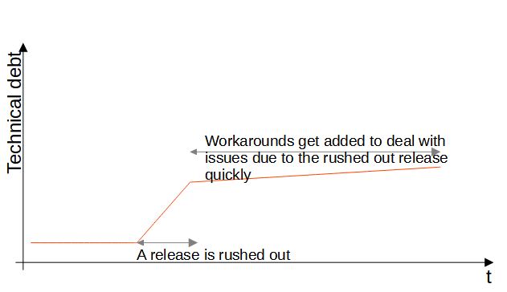

# Technical debt

A lot of code I'm working with in companies is several years old. People might be surprised and think that software changes very quickly - and it does. Both statements are true, a lot of code is very old but it constantly receives modifications and the code and technology around it changes. That means
that developers need to write code which works together with concepts which don't exist yet. Usually a developer rather quickly writes code which does the job, and then spends time to make it well enough to be: Flexible, Testable, Reusable, and Documented.

If there is an important release, then the question arises if the release can be rushed out by skipping steps. The answer is: Yes, and it might be a tool which one wants to keep in mind. But there is a big "BUT". With that decision you will hit issues in the future. This goes so far, that I've seen companies which are basically unable to move anymore due to technical debt (in the words of [Cost of IT projects/features over time](costsovertime.md): Your maintenance cost went far too high over time). The concept of technical debt expresses this as well: Every time you rush a release, you build up debt which you have to pay back in future. As with all debt, it's cheaper to pay it back sooner than later. That's because over time workarounds get added to deal with the issues which a rushed release left behind. So ofter time you don't just have to cleanup your rushed decisions, but also all workarounds which have been created meanwhile.

See also:

- [Wikipedia Technical Debt](https://en.wikipedia.org/wiki/Technical_debt)
- [Martin Fowler (Thoughtworks) on Technical Debt](https://www.martinfowler.com/bliki/TechnicalDebt.html)
